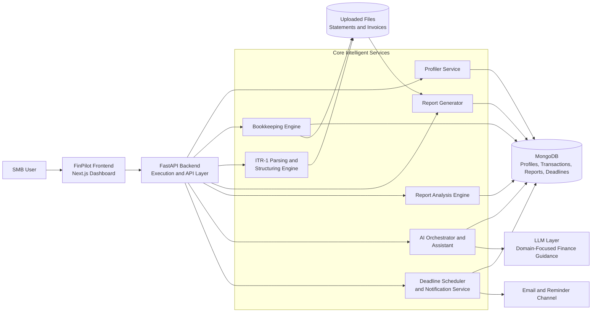

# FinPilot AI CFO

Team Name: Team NPC (Not Paid Coders)  
Team Number: 38

## Overview

FinPilot AI CFO is an intelligent financial co-pilot built for small and medium-sized businesses (SMBs). It combines bookkeeping automation, tax report preparation, ITR-1 field structuring, report validation, deadline tracking, and domain-focused AI assistance in one unified system.

The goal is to reduce manual financial work and help SMBs make better compliance decisions with confidence.

## Problem Statement

SMBs commonly face these issues:

- Limited access to professional CFO and tax expertise
- Financial data scattered across multiple tools and files
- Repetitive data entry in profiles, forms, and reports
- High chance of errors in tax reporting and compliance forms
- Missed filing deadlines due to weak reminder systems
- Passive software that does not guide users proactively

In addition, government forms like ITR-1 are distributed as static PDFs, which makes structured extraction, validation, and automation difficult.

## Our Solution

FinPilot addresses these issues through a modular, agent-driven architecture.

### Core Principles

- Store once, reuse everywhere: persistent profile and financial memory
- Convert unstructured documents into structured machine-readable data
- Use specialized agents for focused tasks with centralized orchestration
- Run asynchronous background processes for reminders and compliance follow-up

## System Modules

### 1. Profiler (Persistent Identity Layer)

- Stores user and business details required for tax and reporting
- Removes repeated data entry across workflows
- Provides trusted base data for downstream modules

### 2. Bookkeeping Engine

- Ingests bank statements and invoices
- Extracts, classifies, and categorizes transactions
- Maintains an up-to-date ledger for reporting and analysis

### 3. ITR-1 Parsing and Structuring Engine

- Extracts fillable fields from ITR-1 templates
- Preserves field identifiers and hierarchy (for example A1, B1, D10a)
- Converts form content into structured JSON for automation
- Supports downstream use cases like prefill, validation, and API workflows

### 4. Report Generator

- Uses profile and ledger data to prefill report fields
- Produces structured report output with fill status
- Highlights missing fields for user completion

### 5. Report Analysis Engine

- Validates generated or uploaded reports
- Detects missing fields, inconsistencies, and basic rule violations
- Returns actionable suggestions before final submission

### 6. Deadline and Notification System

- Maintains compliance calendar events
- Tracks due dates and reminder windows
- Sends proactive reminders through integrated notification channels

### 7. AI Assistant

- Answers finance, tax, and compliance questions
- Uses project context to provide relevant guidance
- Keeps responses focused on business-finance domain tasks

## System Architecture Diagram

## End-to-End Data Flow

1. Profile details are captured and stored once.
2. Financial records are ingested through bookkeeping.
3. Report templates are parsed and transformed into structured fields.
4. Reports are generated and prefilled using profile plus ledger data.
5. Analysis validates report quality and highlights corrections.
6. Deadline engine monitors due dates and sends reminders.
7. AI assistant supports users at every stage.

## Key Capabilities

- Automated bookkeeping from statements and invoices
- Intelligent ITR-1 field extraction and JSON structuring
- Report generation with missing-field detection
- Report validation and error analysis
- Real-time compliance monitoring and reminders
- Conversational AI support for finance and tax workflows

## Tech Stack

- Backend: FastAPI, Python, MongoDB, LangGraph, rule-based parsers
- Frontend: Next.js, TypeScript, React Query, Tailwind CSS
- Integrations: Email notifications and background deadline workers

## Current Scope

- ITR-1 workflow is actively supported end-to-end
- Additional forms can be added by extending the same parsing and mapping architecture

## Impact

FinPilot shifts SMB finance operations from reactive manual processes to proactive intelligent workflows.

- Reduces repetitive effort and operational friction
- Improves accuracy in forms and reports
- Lowers compliance risk and missed-deadline penalties
- Increases access to financial guidance for small businesses

## Future Scope

- Real-time banking API integrations
- Broader ITR form support
- Advanced tax optimization strategies
- Dynamic form UI generation from extracted JSON schema
- Voice-enabled assistant experiences

## Project Philosophy

From manual bookkeeping to intelligent financial orchestration.